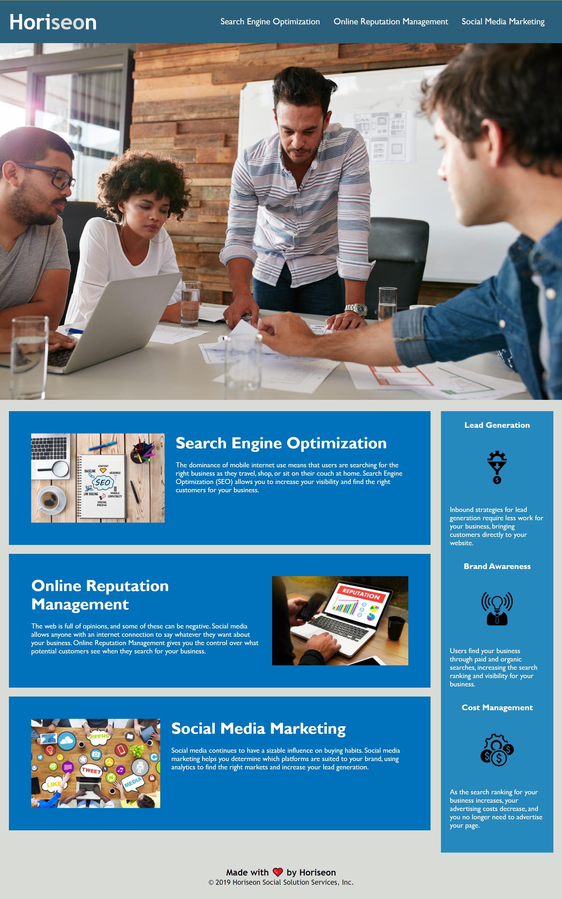

# HORISEON ACCESSIBILITY

## PURPOSE

The codebase of this project ensures that it meets accesibility standards for the Horiseon Social Solution Services Inc. webpage such that it is optimized for search engines. 

ACCEPTANCE CRITERIA
-------------------
- Source code includes semantic HTML elements 
- HTML elements follow a logical structure
- Title element includes concise, descriptive title
- Heading attributes are in sequential order 
- All image elements have accessible alt attributes
- Application's links all function correctly.
- Application's CSS selectors and properties are consolidated and organized to follow semantic structure.
- Application's CSS file is properly commented.

## BUILT WITH

* HTML
* CSS 

## Website 

[This is an external link to published site] (https://acdodd17.github.io/horiseon-accessibility/)

WEBPAGE APPLICATION APPEARANCE
------------------------------

## Contribution

Refactored with ❤️ by Anna Dodd
